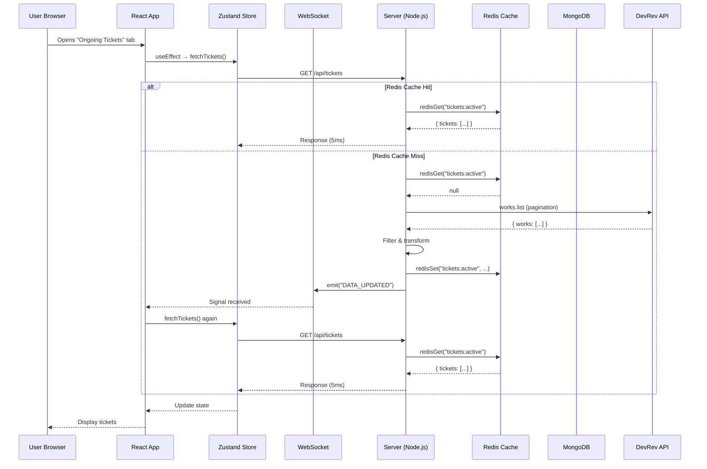
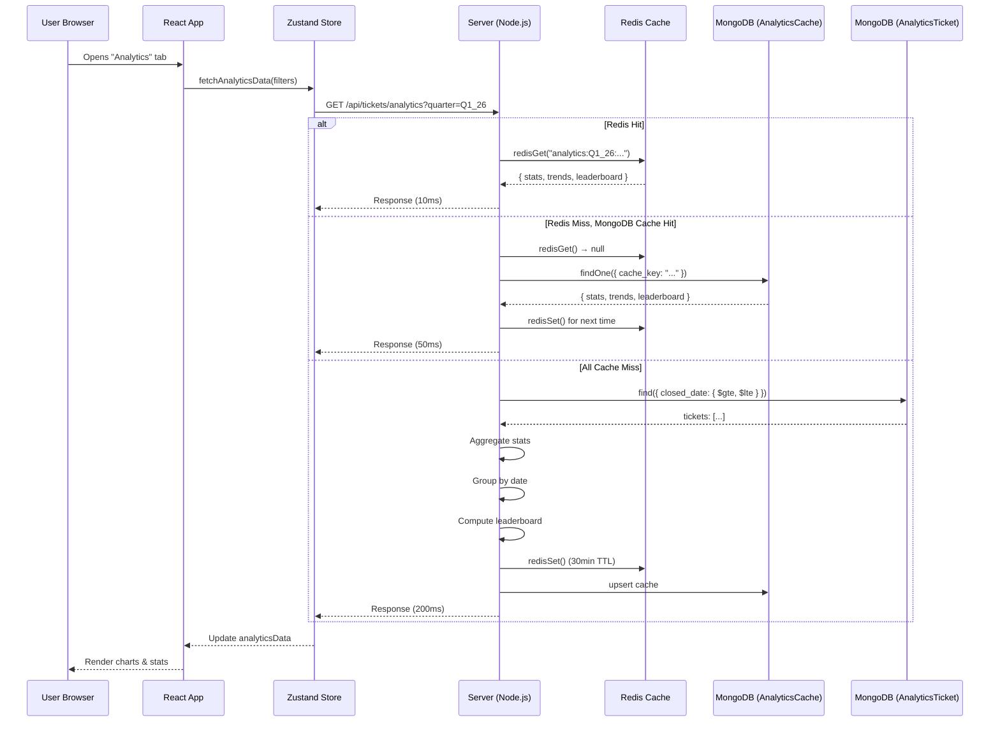
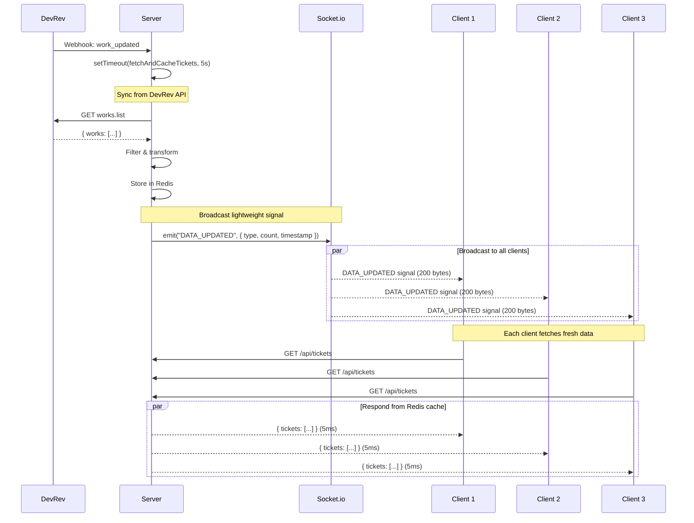

# 👨‍💻 Developer Quick Start Guide

## 🚀 Getting Started in 5 Minutes

### **Prerequisites**
```bash
Node.js >= 18.x
MongoDB >= 5.x
Redis >= 6.x
```

### **1. Clone & Install**
```bash
git clone <repo-url>
cd support-dashboard

# Install backend dependencies
cd backend
npm install

# Install frontend dependencies
cd ..
npm install
```

### **2. Configure Environment**

**Backend (.env)**:
```bash
cd backend
cp .env.example .env

# Edit .env:
MONGO_URI=mongodb+srv://your-cluster-url
REDIS_URL=redis://localhost:6379
VITE_DEVREV_PAT=your_devrev_token
GOOGLE_CLIENT_ID=your_google_client_id
PORT=5000
```

**Frontend (.env)**:
```bash
cd ..
cp .env.example .env

# Edit .env:
VITE_API_URL=http://localhost:5000
```

### **3. Start Services**

**Terminal 1 - Redis**:
```bash
redis-server
```

**Terminal 2 - Backend**:
```bash
cd backend
npm start
# Expected: 🚀 Server on port 5000
```

**Terminal 3 - Frontend**:
```bash
npm run dev
# Expected: ⚡ Local: http://localhost:5173
```

### **4. Verify Setup**

```bash
# Check backend health
curl http://localhost:5000/api/health

# Check Redis connection
curl http://localhost:5000/api/cache/status

# Create MongoDB indexes
cd backend
node create-indexes.js
```

---

## 📊 Data Flow Diagrams

### **1. Ongoing Tickets Tab - Request Flow**



### **2. Analytics Section - Aggregation Flow**



### **3. Real-Time Sync via WebSocket**



---

## 🧩 Component Integration Examples

### **Example 1: Adding a New Filter**

**Step 1: Update `App.jsx` (Filter Configuration)**

```javascript
// File: src/App.jsx

const FILTER_CONFIG = [
  // ... existing filters
  { key: "priority", label: "Priority", icon: AlertTriangle }, // ✅ Add this
];
```

**Step 2: Update `Allticketsview.jsx` (Apply Filter)**

```javascript
// File: src/components/Allticketsview.jsx

const filteredTickets = useMemo(() => {
  return tickets.filter((ticket) => {
    // ... existing filters

    // ✅ Add priority filter
    if (filters.priority?.length > 0) {
      const ticketPriority = ticket.priority?.toLowerCase() || "";
      if (!filters.priority.some((p) => ticketPriority.includes(p.toLowerCase()))) {
        return false;
      }
    }

    return true;
  });
}, [tickets, filters]);
```

**Step 3: Test**
```bash
# Restart frontend
npm run dev

# Filter should appear in UI
# Select "High" priority → Only high-priority tickets show
```

---

### **Example 2: Adding a New Metric to Analytics**

**Step 1: Update Backend Aggregation**

```javascript
// File: backend/server.js (in /api/tickets/analytics)

const stats = {
  totalTickets: tickets.length,
  avgRWT: calculateAverage(tickets, "rwt"),
  avgFRT: calculateAverage(tickets, "frt"),
  // ✅ Add new metric: Average Backlog Age
  avgBacklogAge: calculateAverage(
    tickets.filter((t) => {
      const ageInDays = (t.closed_date - t.created_date) / (1000 * 60 * 60 * 24);
      return ageInDays > 15; // Backlog = >15 days
    }),
    (t) => (t.closed_date - t.created_date) / (1000 * 60 * 60 * 24)
  ),
};
```

**Step 2: Update Frontend Display**

```javascript
// File: src/components/AnalyticsDashboard.jsx

const OVERVIEW_METRICS = [
  // ... existing metrics
  {
    metric: "Backlog Age",
    value: stats?.avgBacklogAge?.toFixed(1) || "0.0",
    label: "Avg Backlog Age (days)",
    icon: Clock,
    color: "red",
  },
];
```

**Step 3: Clear Cache & Test**

```bash
# Clear caches
curl -X POST http://localhost:5000/api/cache/clear

# Refresh analytics tab
# New "Backlog Age" card should appear
```

---

### **Example 3: Creating a Custom View**

**User Flow**:

```javascript
// 1. User applies filters in UI
const filters = {
  owners: ["Rohan", "Archie"],
  regions: ["US"],
  priority: ["high"],
};

// 2. User clicks "Save View" button
<button onClick={() => {
  const viewName = prompt("Enter view name:");
  saveView(viewName, filters);
}}>
  <Save className="w-4 h-4" />
  Save View
</button>

// 3. store.js handles save
const saveView = async (name, currentFilters) => {
  const response = await fetch(`${API_URL}/api/views`, {
    method: "POST",
    headers: { "Content-Type": "application/json" },
    body: JSON.stringify({
      userId: currentUser.email,
      name,
      filters: currentFilters,
    }),
  });
  // View saved to MongoDB
};

// 4. User loads view later
<button onClick={() => {
  const view = myViews.find((v) => v.name === "High Priority US");
  applyFilters(view.filters);
}}>
  <FolderOpen className="w-4 h-4" />
  {view.name}
</button>
```

---

## 🔧 Common Development Tasks

### **Task 1: Add New DevRev Field to Tickets**

```javascript
// 1. Update backend transform (server.js: fetchAndCacheTickets)
.map((t) => ({
  id: t.id,
  display_id: t.display_id,
  // ... existing fields
  sla_status: t.custom_fields?.sla_status || "unknown", // ✅ Add new field
}))

// 2. Update frontend (Allticketsview.jsx)
<div className="text-xs text-slate-400">
  SLA: {ticket.sla_status} {/* ✅ Display new field */}
</div>

// 3. Restart backend & frontend
// 4. Force sync: curl -X POST http://localhost:5000/api/tickets/sync
```

---

### **Task 2: Modify Gamification Scoring**

```javascript
// File: backend/server.js (in /api/gamification)

const calculatePoints = (engineer) => {
  let points = 0;

  // Existing scoring
  points += engineer.totalTickets * 10;
  if (engineer.avgRWT < 2) points += 50;

  // ✅ Add new scoring rule: Bonus for high FRR
  if (engineer.frrPercent > 90) points += 100; // Big bonus for 90%+ FRR

  return points;
};

// Clear cache & refresh gamification tab
```

---

### **Task 3: Add New MongoDB Index**

```javascript
// File: backend/server.js (after AnalyticsTicketSchema definition)

// ✅ Add new index for custom queries
AnalyticsTicketSchema.index({ priority: 1, closed_date: -1 });
// This speeds up queries like: find({ priority: "high" }).sort({ closed_date: -1 })

// Run index creation
// Method 1: Restart server (indexes auto-create)
// Method 2: Run script
node backend/create-indexes.js
```

---

## 🐛 Debugging Guide

### **Problem 1: Tickets Not Loading**

**Symptoms**:
- "Loading configuration..." never completes
- Empty ticket list

**Debug Steps**:

```bash
# 1. Check Redis connection
curl http://localhost:5000/api/cache/status
# Expected: { redis: { status: "ready" } }

# 2. Check backend logs
cd backend
npm start
# Look for: ✅ Redis Connected

# 3. Force sync
curl -X POST http://localhost:5000/api/tickets/sync

# 4. Check Redis cache
redis-cli
> GET tickets:active
> TTL tickets:active
# Should return JSON or TTL seconds

# 5. If still failing, check DevRev API token
curl -H "Authorization: Bearer YOUR_TOKEN" \
  https://api.devrev.ai/works.list?limit=1
```

---

### **Problem 2: Analytics Not Updating**

**Symptoms**:
- Old data showing
- Changes not reflected

**Debug Steps**:

```bash
# 1. Clear all caches
curl -X POST http://localhost:5000/api/cache/clear

# 2. Check MongoDB data
mongo "mongodb+srv://..."
> use support_dashboard
> db.analyticstickets.countDocuments()
# Should return ticket count

> db.analyticstickets.find().limit(1).pretty()
# Verify data structure

# 3. Force analytics refresh (add forceRefresh=true)
curl "http://localhost:5000/api/tickets/analytics?quarter=Q1_26&forceRefresh=true"

# 4. Check indexes
> db.analyticstickets.getIndexes()
# Verify compound indexes exist
```

---

### **Problem 3: WebSocket Not Working**

**Symptoms**:
- No real-time updates
- Console shows: "🔴 Disconnected"

**Debug Steps**:

```javascript
// 1. Check browser console
// Expected: "🟢 Connected to Real-Time Server"

// 2. Verify Socket.io connection
const { socket } = useTicketStore.getState();
console.log("Socket:", socket);
console.log("Connected:", socket?.connected);

// 3. Check CORS settings (backend/server.js)
const io = new Server(server, {
  cors: { origin: "*" } // ✅ Allow all origins (dev only)
});

// 4. Test WebSocket manually
// In browser console:
import io from "socket.io-client";
const socket = io("http://localhost:5000");
socket.on("connect", () => console.log("Connected!"));
socket.on("DATA_UPDATED", (data) => console.log("Update:", data));

// 5. Check firewall/proxy settings
// WebSocket uses port 5000 (same as HTTP)
```

---

## 📊 Performance Monitoring

### **Key Metrics to Track**

```bash
# 1. Memory Usage
curl http://localhost:5000/api/cache/status | jq .memory
# Target: heapUsed < 300MB

# 2. Redis Cache Hit Rate
# Check logs for:
grep "Redis HIT" backend/logs/server.log | wc -l
grep "Redis MISS" backend/logs/server.log | wc -l
# Target: 90%+ hit rate

# 3. API Response Times
time curl http://localhost:5000/api/tickets
# Target: < 100ms

# 4. MongoDB Query Performance
mongo "mongodb+srv://..."
> use support_dashboard
> db.analyticstickets.find({ closed_date: { $gte: ISODate() } }).explain("executionStats")
# Check: executionTimeMillis < 50ms
```

### **Load Testing**

```bash
# Install Apache Bench
brew install httpd  # macOS
sudo apt-get install apache2-utils  # Linux

# Test ongoing tickets endpoint
ab -n 1000 -c 50 http://localhost:5000/api/tickets
# Expected: Requests/sec > 100

# Test analytics endpoint
ab -n 100 -c 10 "http://localhost:5000/api/tickets/analytics?quarter=Q1_26"
# Expected: Requests/sec > 20
```

---

## 🔒 Security Checklist

### **Before Production Deployment**

- [ ] Change `cors: { origin: "*" }` to specific domains
- [ ] Enable rate limiting (e.g., `express-rate-limit`)
- [ ] Use environment-specific `.env` files
- [ ] Enable HTTPS for all endpoints
- [ ] Validate all user inputs (XSS protection)
- [ ] Add authentication middleware to sensitive endpoints
- [ ] Use MongoDB connection string with authentication
- [ ] Enable Redis password (`requirepass` in redis.conf)
- [ ] Add logging & monitoring (e.g., Datadog, New Relic)
- [ ] Set up automatic backups for MongoDB

---

## 📚 Reference Links

### **Documentation**
- [MongoDB Indexes](https://docs.mongodb.com/manual/indexes/)
- [Redis Commands](https://redis.io/commands/)
- [Socket.io Docs](https://socket.io/docs/v4/)
- [Zustand Guide](https://github.com/pmndrs/zustand)
- [React Query (optional future upgrade)](https://tanstack.com/query/latest)

### **Troubleshooting**
- [Node.js Memory Leaks](https://nodejs.org/en/docs/guides/simple-profiling/)
- [MongoDB Slow Queries](https://docs.mongodb.com/manual/tutorial/manage-the-database-profiler/)
- [Redis Debugging](https://redis.io/topics/debugging)

---

## 🎯 Next Steps

### **Recommended Improvements**

1. **Add TypeScript** (type safety)
2. **Implement React Query** (better caching & refetch logic)
3. **Add unit tests** (Jest + React Testing Library)
4. **Set up CI/CD** (GitHub Actions for auto-deploy)
5. **Add error tracking** (Sentry or Bugsnag)
6. **Implement pagination UI** (for large ticket lists)
7. **Add dark mode persistence** (sync across devices)
8. **Create API documentation** (Swagger/OpenAPI)

---

**Last Updated**: 2026-01-24
**Version**: 1.0
**Maintainer**: Support Engineering Team
